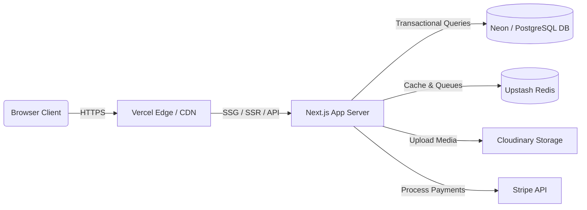

# LuxStore Production Operations & DevOps Manual

This document provides instructions for deploying, scaling, caching, securing, backing up, and monitoring the LuxStore e-commerce platform.

---

## 1. Deployment Guide

### Frontend: Vercel Setup
1. **Repository Link**: Link your GitHub repository to Vercel.
2. **Build Configuration**:
   - Framework Preset: **Next.js**
   - Build Command: `npm run build`
   - Output Directory: `.next`
3. **Environment Variables**: Populate frontend configurations (e.g., `NEXT_PUBLIC_APP_URL`, `NEXT_PUBLIC_STRIPE_PUBLISHABLE_KEY`).

### Backend: Railway Setup
1. **Services Deployment**:
   - Connect Railway to your repository.
   - Deploy backend API handlers and queues using Node.js v20.
2. **PostgreSQL**: Create a Railway PostgreSQL database instance and copy the `DATABASE_URL`.
3. **Redis**: Create a Railway Upstash Redis or standard Redis instance and copy the `REDIS_URL`.

---

## 2. Infrastructure Guide

### Resource Matrix
- **Database**: PostgreSQL (Prisma Client ORM) with connection pooling (maximum 20 connections per lambda instance).
- **Cache & Jobs Queue**: Redis cluster for caching (TTL 1 hour) and BullMQ workers for background events processing (max concurrency 5).
- **Object Storage**: Cloudinary secure image optimization.

---

## 3. Caching Strategy

The Redis integration implements active cache lookup and invalidation.

| Cache Key | TTL | Invalidation Triggers |
|---|---|---|
| `product:detail:[slug]` | 3600s | Stock adjustments, product detail edits, product deletions |
| `product:related:[productId]` | 3600s | Category updates, brand updates, product deletions |
| `category:list` | 7200s | Category creation, editing, sorting, deactivations |
| `brand:list` | 7200s | Brand creation, logo uploads, brand deactivations |
| `settings:all` | 86400s | Settings edits, settings resets |

---

## 4. Monitoring & Observability

### Sentry Integration
1. Initialize Sentry in `sentry.client.config.js` and `sentry.server.config.js` to catch client/server exceptions.
2. Configure environment limits for transaction trace rates (`tracesSampleRate: 0.1` in production).

### Health Checks
- **Combined Health**: `/api/health` returns general server states.
- **Database Health**: `/api/health/database` returns database raw query latencies.
- **Cache Health**: `/api/health/cache` tests Redis read/write transaction speeds.
- **Storage Health**: `/api/health/storage` confirms Cloudinary configs.
- **Payments Health**: `/api/health/payments` asserts Stripe API key configuration.

---

## 5. Security Hardening Policies

- **CSP Headers**: Configured in Next.js middleware to strictly enforce `default-src 'self'`. Scripts, frames, and sockets are restricted to allowed hosts (like Stripe integration).
- **CSRF Token Guards**: All mutating request methods (POST, PUT, PATCH, DELETE) compare origin and referer domain names.
- **JWT Key Requirements**: Signature keys must be 32+ characters long.
- **Secure Cookies**: Access tokens are stored as `HttpOnly`, `Secure`, `SameSite=Strict` cookies.

---

## 6. Backup & Disaster Recovery Plan

### Automated Database Backups
- **Policy**: Daily database snapshots with 30-day retention policies using Railway/Neon Postgres automated backups.
- **Manual Backups**: Run `pg_dump -d $DATABASE_URL -f backup.sql` to export snapshot schemas and contents manually.

### Restore Procedure
1. Create a clean database target.
2. Run database structure migrations: `npx prisma db push`.
3. Restore snapshot records: `psql -d $DATABASE_URL -f backup.sql`.

---

## 7. Incident Response Playbook

### High Latency Alert (>1000ms response spikes)
1. Query health checks at `/api/health/database` and `/api/health/cache` to isolate the slow subsystem.
2. Inspect the database connection pool sizing. Increase pools in environment settings if exhausted.
3. Review long-running queries in PostgreSQL activity logs. Add matching database indexes where required.

### Database Connection Exhaustion (500 Error Spikes)
1. Check if the database instance connection cap has been breached.
2. Configure connection pooling variables in `DATABASE_URL` (e.g., `?connection_limit=10`).
3. Flush Redis caches to reduce database lookups.
